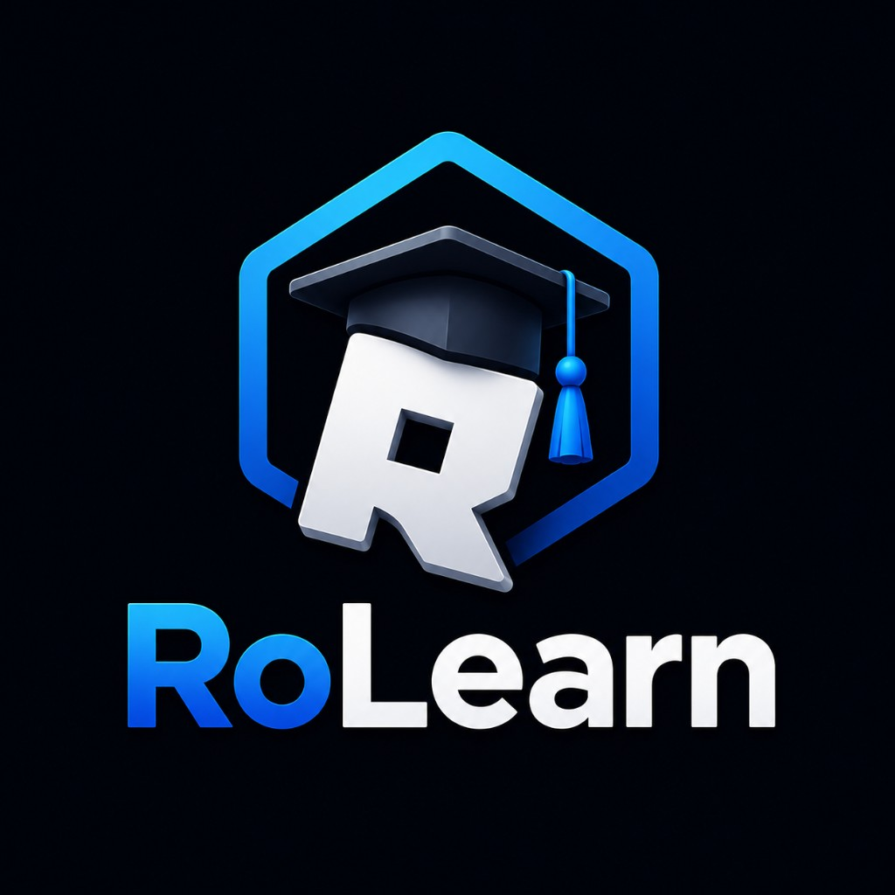

# RoLearn

The all-in-one platform for Roblox creators to **learn**, **teach**, **collaborate**, build a reputation, and get hired.



## Features

- **Roblox Bio Verification** — Sign in with your Roblox username; verify ownership by pasting a one-time code in your profile bio
- **Public Profiles** — `/u/username` with portfolio, skills, services, and reviews
- **Direct Messages** — Message creators from profiles or listings
- **Apply Buttons** — Apply to jobs, join teams, or hire for services
- **Search & Filters** — Find creators, services, jobs, and teams by keyword, skill, and hire status
- **Trust Levels** — Reputation scoring beyond simple verification badges
- **Creator Studio** — Manage profile, portfolio, courses, marketplace listings, and team posts
- **Marketplace** — Browse services and jobs with skill filters
- **Team Finder** — Recruit scripters, builders, UI designers, and more

## Tech stack

- **Next.js 16** (App Router) + TypeScript + Tailwind CSS v4
- **Prisma** + PostgreSQL ([Neon](https://neon.tech) free tier)
- **NextAuth** with Roblox bio verification (no OAuth keys needed)
- **Vercel** hosting (free hobby tier)
- **Icons8** for UI icons (CDN)
- **Roblox Public API** for account verification

## Getting started

```bash
git clone https://github.com/popesmoke/RoLearn.git
cd RoLearn
npm install
cp .env.example .env
# Add DATABASE_URL and AUTH_SECRET to .env
npx prisma db push
npm run dev
```

Open [http://localhost:3000](http://localhost:3000) and sign in with your Roblox username.

## App routes

| Route | Description |
|---|---|
| `/` | Landing page |
| `/explore` | Unified feed of services, jobs, and team posts |
| `/marketplace` | Services and jobs with tabs |
| `/teamfinder` | Open team recruitment posts |
| `/search` | Search with type, skill, and hire filters |
| `/messages` | Direct message inbox |
| `/u/[username]` | Public creator profile |
| `/dashboard` | Creator studio (auth required) |

## Deployment

See **[docs/HOSTING.md](docs/HOSTING.md)** for the complete free hosting tutorial:

- Vercel deployment ($0)
- Neon PostgreSQL setup ($0)
- Roblox bio verification (no API keys)
- Environment variables
- Troubleshooting

## Project structure

```
RoLearn/
├── docs/HOSTING.md           # Free hosting guide
├── prisma/schema.prisma      # Database schema
├── public/logo.png           # Brand assets
└── src/
    ├── app/                  # Pages & API routes
    ├── components/           # UI components
    └── lib/                  # Roblox API, auth helpers
```

## License

MIT
